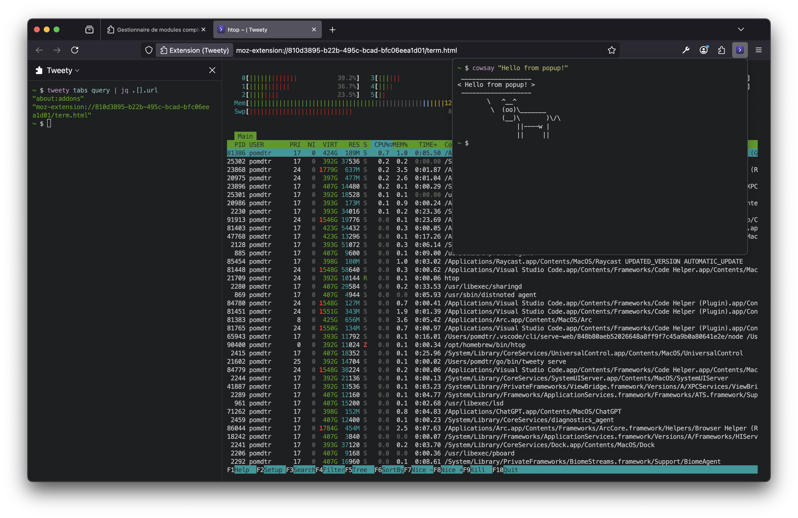

# Tweety - An Integrated Terminal for your Browser



## Features

- terminal tabs
- terminal panel in devtools
- terminal popup
- forward the chrome extension API to your shell
- bookmark commands

## Installation

### Using [Homebrew](https://brew.sh/) (recommended)

First install the `tweety` cli:

```sh
brew install pomdtr/tap/tweety
tweety install manifest
```

Then go to `chrome://extensions/` in your browser, enable "Developer mode" and click on "Load unpacked". Select the `/opt/homebrew/share/tweety/extensions/chrome` on macOS or `/home/linuxbrew/.linuxbrew/share/tweety/extensions/chrome` on Linux.

You can upgrade tweety using `brew update && brew upgrade tweety`. Make sure to reload the extension in your browser after upgrading.

### Manual Installation

You can also install the extension manually by downloading the latest release from the [releases page](https://github.com/pomdtr/tweety/releases) and extracting it to a directory of your choice.

In addition to running the `tweety install manifest` command, you'll need to install the extension assets manually.

Each binary embed the chrome extension assets, and you can extract them using:

```sh
tweety install extension <dest-dir>
```

Then go to `chrome://extensions/` in your browser, enable "Developer mode" and click on "Load unpacked". Then, select the directory where you extracted the extension.

If you upgrade tweety, you'll need to use the `--overwrite` flag to also upgrade the extension assets:

```sh
tweety install extension <dest-dir> --overwrite
```

You can install completions for your shell using the `tweety completion` command.

## Usage

Click on the extension icon in your browser toolbar to open a new terminal.

### `tweety` command

Use the `tweety` command to create new terminal tabs, or interact with the chrome extension API.

Make sure to setup the completions using the `tweety completion` command.

### Custom Commands

You can register custom subcommands for the `tweety` cli by creating executables in the `~/.config/tweety/commands` directory. Each executable should be a single file and will be available as `tweety <command-name>`.

For example, you can create `~/.config/tweety/commands/copy-markdown-link.sh` with the following content:

```sh
#!/bin/sh

CURRENT_TAB=$(tweety tabs get)
URL=$(echo "$CURRENT_TAB" | jq -r .url)
TITLE=$(echo "$CURRENT_TAB" | jq -r .title)

printf "[%s](%s)" "$TITLE" "$URL" | pbcopy
```

Then invoke it with `tweety copy-markdown-link` to copy the current tab's title and URL as a markdown link to your clipboard.

### Apps

You can create new apps by adding executables to the `~/.config/tweety/apps` directory. Each app should be a single executable file.

Each app is accessible at `chrome-extensions://<extension-id>/term.html?mode=app&app=<app-name>`, where `<app-name>` is the name of the executable file.

For example, I can create a file `~/.config/tweety/apps/htop.sh` with the following content:

```sh
#!/bin/sh

exec /opt/homebrew/bin/htop
```

And access it at `chrome-extensions://pofgojebniiboodkmmjfbapckcnbkhpi/term.html?mode=app&app=htop` or open it in a new tab using the `tweety run htop` command.

### Configuration

```jsonc
// ~/.config/tweety/config.json
{
    "command": "/opt/homebrew/bin/fish", // The command to run in the terminal
    "args": [
        "--login" // Arguments to pass to the command
    ],
    "env": {
        // Environment variables to set in the terminal
    },
    "xterm": {
        // Xterm.js configuration (see https://xtermjs.org/docs/api/terminal/interfaces/iterminaloptions/)
        "fontSize": 14,
        "cursorBlink": false
    },
    "theme": "Tomorrow", // The theme to use for the terminal
    "themeDark": "Tomorrow Night" // The theme to use for the terminal in dark mode
}
```

You can find out the available themes by checking the `internal/cmd/themes` folder. The theme name corresponds to the name of the file without the `.json` extension.
